# Schedule 69 — Cedar Street

A small, original Three.js neighbourhood for a standalone Quest 3 VR game. Cedar Street includes a gas station, market, laundromat, diner, apartments, garage, and fenced houses. Pine Avenue continues north through two enterable shops and south to a residential stretch with an unfurnished starter house and a neighbouring home. At the far eastern end, Cedar Street meets a coastal road and the Cedar Beach esplanade. Gameplay, NPCs, drivable vehicles, inventory, and interior furniture are not implemented yet.

## Neighbourhood character pass

The existing district now has several small places to discover, without extending the roads or map bounds:

- **Cedar Corner**, beside the original houses: a low-walled neighbourhood square with planted beds, picnic seating, hopscotch paving and a parked bicycle.
- **Pine Patch**, opposite Pine Supply and Pine General: a fenced community garden with vegetable beds, a climbing trellis, seed-swap notice, pergola, picnic tables and a sun-and-coast mural.
- **Cedar Street bus shelter**: a timber-backed shelter around the existing bench, with a local route board and a clear pavement in front.
- **Riverside repair yard**: a covered work area behind the garage with tyre stacks, a workbench, toolboxes and parts shelving.
- **Cedar Beach picnic shelter**: a roofed table and bicycle rack beside the promenade, leaving its central walking route and both beach ramps open.

Smaller details connect these places: market produce crates, a diner menu board, a laundromat poster, shop-side plant displays, washing lines, stacked firewood, flowerpots and garden-edge planting. These are static environmental props. The starter house remains unfurnished and its central rear garden stays available for future gameplay.

All additions use the existing materials, lighting and 2048-square sign texture. Short fascia signs now pack into smaller atlas slots, making room for the new notices without increasing texture memory. The pass adds 15,917 triangles (about 11.8%) and introduces no per-frame animation work.

## Cedar Beach esplanade

From spawn, follow Cedar Street east through the Pine Avenue intersection and past Cedar Court. The street opens into a **T-junction with the Esplanade**, a 146 m coastal road beside a broad waterfront promenade.

The promenade has ocean-facing benches, lamps, pine planting beds, beach signs, crossings, and a continuous seawall railing. Two gently sloping ramps lead down to the sand. Player ground height follows the ramps and beach surface, and the railing prevents walking off the seawall. The beach extends to a shallow shoreline; swimming is not implemented.

The ocean has subtle animated swell, ripples and shoreline foam. It uses one opaque shader draw with no reflection cameras or screen effects. The road ends are framed by barriers and coastal rocks, leaving clear places for a later extension.

## Pine Avenue extension

From the Cedar Street intersection, follow Pine Avenue past the market toward the commercial end to find **Pine Supply** and **Pine General**. Both have open entrances, an empty main shop floor, a separate stockroom, and a rear exit.

In the opposite direction, past the garage and the rear service lane, **No. 18 Pine Avenue** is the green starter house. Its front and rear doors are propped open. Inside are a living room, bedroom, utility room, bathroom and central hall; the rear door leads to a fenced garden with planting at its edges. The house across the street is exterior scenery.

Doors are static for this environment pass. There is no ownership, purchasing, shop stock, or door interaction yet. The architectural spaces are ready to build those systems into later.

## Town visual pass

- Raised the lawns to meet paving and extended foundations below the grass. House porches now have solid bases, level floors, and complete paths to the sidewalk.
- Anchored the fire escape to its building with wall plates and diagonal supports. Its landings align with the upper windows.
- Kept window layouts inside the facade edges, aligned upper floors around building corners, and added missing upper windows to the two-storey houses' rear and side walls.
- Mounted air conditioners and signs against their wall surfaces, rebuilt the garage shutters, and paved the shop and garage approaches.
- Removed overlapping surfaces at service-lane crossings, porches and door thresholds. Reduced shadow bias to keep shadows closer to the objects casting them.

## Explore

Open the GitHub Pages deployment directly in Meta Quest Browser and select **Enter VR**.

| Input | Action |
| --- | --- |
| Left thumbstick | Smooth, head-relative walking |
| Right thumbstick | Smooth turning, around the headset |
| Left stick click | Faster walking while held |
| Desktop WASD | Walk |
| Desktop Shift | Walk faster |
| Mouse drag / locked pointer | Look |
| Arrow keys | Forward/backward and smooth turning |
| Mobile left pad | Walk |
| Mobile drag | Look |

Movement is in metres. Normal walking is 2.4 m/s; smooth turning is about 77 degrees/s. WebXR uses `local-floor` to preserve the headset's measured height. The rig is offset when turning to keep the physical head position fixed. Buildings, fences, poles, trees, and large props have collision; movement slides along obstacles and is subdivided to prevent tunnelling.

## Development

```sh
npm ci
npm run dev
npm run check
npm run build
```

GitHub Actions builds and deploys `dist/` on pushes to `main`. Repository Settings → Pages should use **GitHub Actions** as the source. All production scripts are bundled locally; there are no runtime CDN, API, or asset-service dependencies.

## Scene structure

- `src/world.js`: layout and reusable building, house, fence, tree, and street-prop builders. Building fronts face local +Z. Use `b.area(x, z, yaw, callback)` to place a lot; distances use metres.
- `src/pine-avenue.js`: new shop shells, starter-home layout, real door/window openings, garden, and street extension. Named scene nodes `PineSupply`, `PineGeneralStore`, and `StarterHouse` identify the usable spaces. `world.places` and `world.starterHouse` expose their entrance and room positions for future gameplay integration.
- `src/coast.js`: coastal T-junction, promenade, seawall, beach ramps and sand mesh. `world.coast` exposes road, promenade, ramp and shoreline destinations.
- `src/neighbourhood-details.js`: static gathering spaces, shop displays, service-yard props and household details. `world.details.destinations` exposes eight named arrival points for route checks and future integration.
- `src/surfaces.js`: shared coast dimensions and surface-height functions used by both geometry and locomotion.
- `src/ocean.js`: the `CedarOcean` mesh and animated water shader, advanced through `world.update(seconds)`.
- `src/geometry.js`: geometry batching, collision, and headset-pivot turning. Static pieces are merged by material and 40 m spatial cell for frustum culling.
- `src/materials.js`: deterministic texture generation and shared sign atlas. Brick, concrete, asphalt, roofing, and siding have metre-scaled UVs. Replace maps here when adding authored textures later.
- `src/main.js`: rendering, lighting, player rig, desktop/touch input, and WebXR session lifecycle.

The current scene contains 14 buildings, 69 instanced pines, about 150,625 geometry triangles (including the ocean, excluding sky and hand models), and 413 collision bounds. The initial desktop frustum intersects about 263 environment draw batches. Trees in the extension lots were moved or removed to keep paths and interiors clear. These are geometry counts, not a measured Quest frame rate.

Rendering uses Lambert materials, shared procedural textures, one static 2048 px directional shadow map, and WebXR foveation. Shadows are refreshed at startup and on VR session transitions. If a future change moves shadow casters, explicitly invalidate the shadow map or change the shadow update strategy.

## Verification

Production build, finite geometry, collision tunnelling/sliding, world boundaries, and turning with an offset headset have been checked. The neighbourhood check verifies 35 connected destinations from the original spawn, open entrances at head height, doorway traversal, rear garden access, solid wall collision, closed ceilings, and floors at the correct player height. It also probes lawn levels, foundations, complete front paths, service-lane crossings, fire escape attachment and facade edges. Coastal checks cover the direct street connection, both beach ramps, continuous ramp heights, seawall collision, terrain heights and the water animation update. The character pass adds eight through-route checks in both directions and checks that all sign UVs fit inside the atlas. Both checks run before deployment. Live browser rendering, touch input, and real headset performance were not verified for this pass.

The character pass was inspected from eleven street-level offline views across the new spaces, shop fronts and gardens. The final review also corrected sign supports and intersections at the bus shelter and garage.

The visual pass was inspected from 13 offline views covering both streets, front and rear gardens, the fire escape, garage, gas station, shop fronts and house foundations.

The waterfront extension was inspected from eight further offline views, including arrival at the junction, both promenade directions, a ramp, the beach looking back at town, the shoreline, an overview and the original street. The ocean shaders compiled and rendered in the offline EGL renderer after adapting Three.js shader inputs to desktop GLSL. This does not replace native WebGL or headset validation.

The images below are **offline geometry previews**, rendered from the same scene meshes and textures with approximate lighting. They are not browser screenshots or Quest performance evidence.

Neighbourhood character pass:

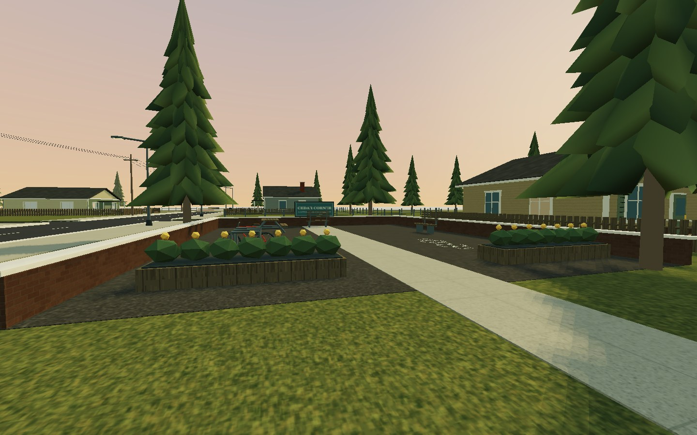
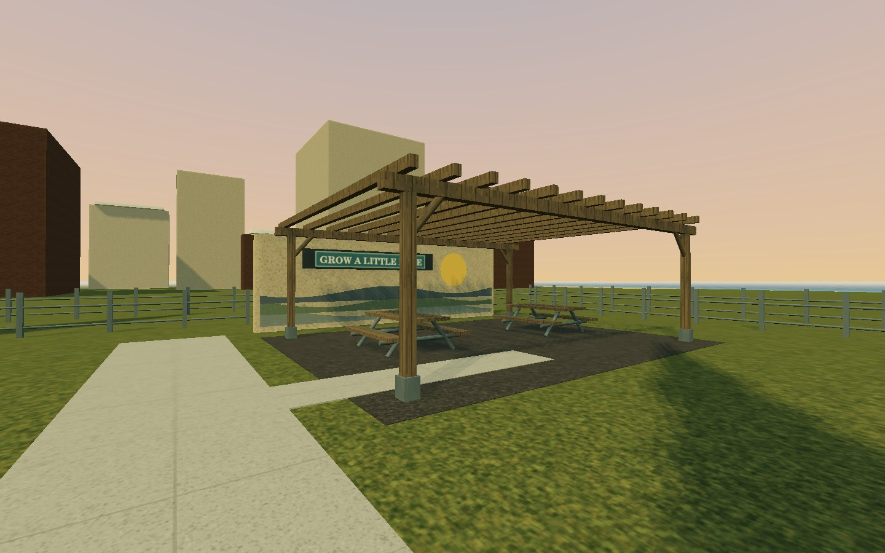
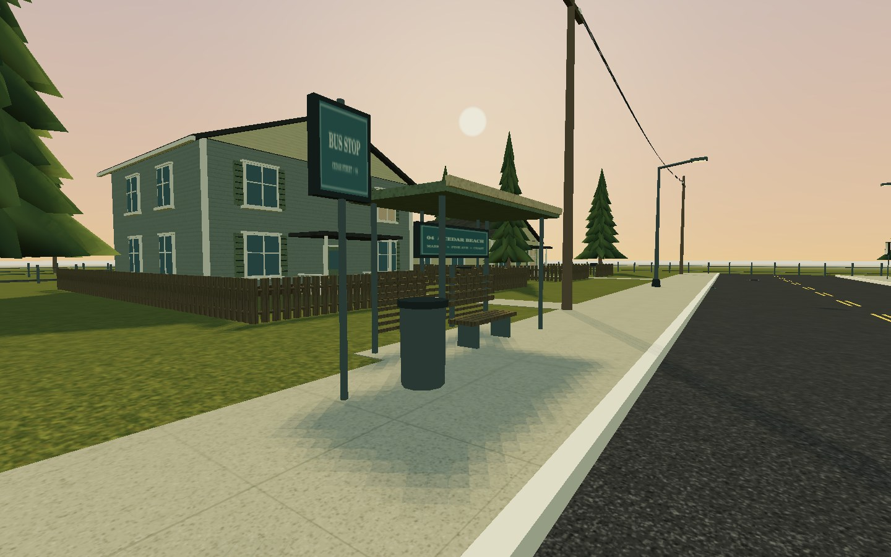

Cedar Beach extension:

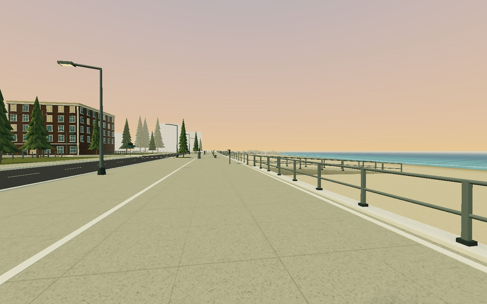
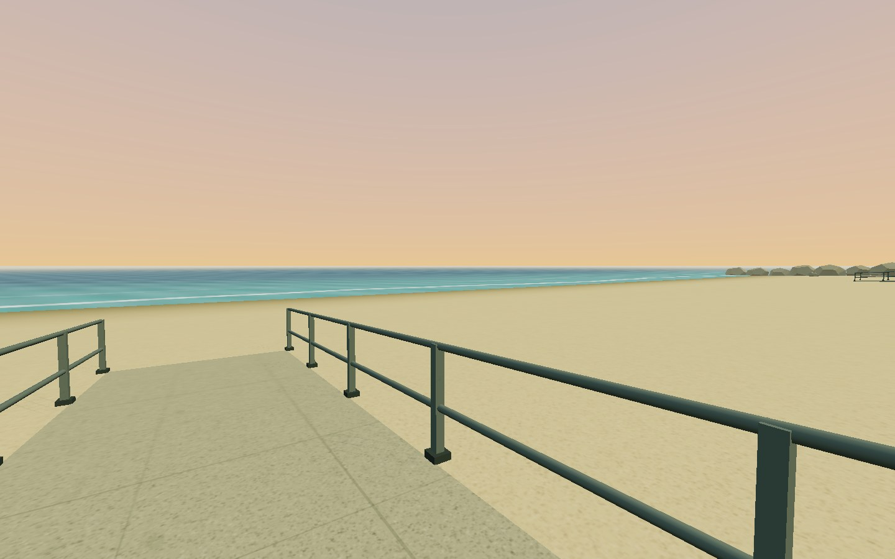
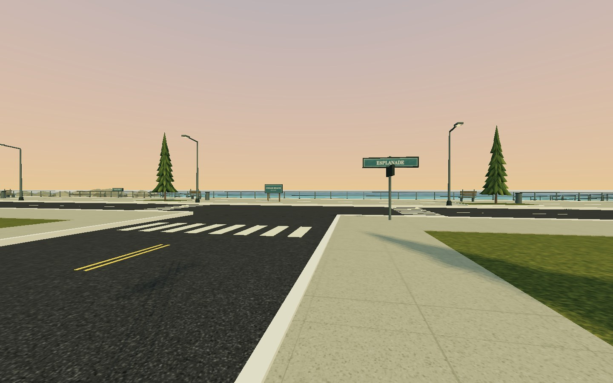

Town visual pass:

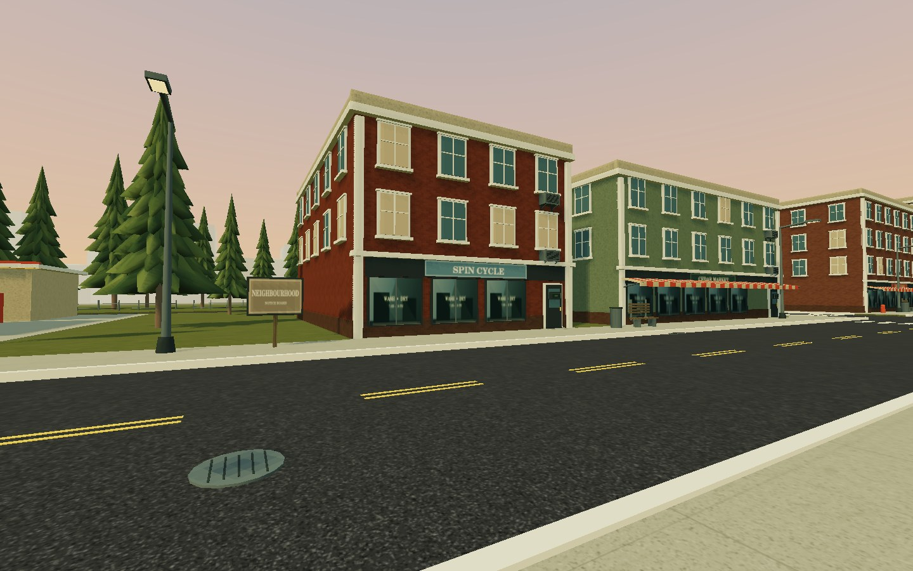
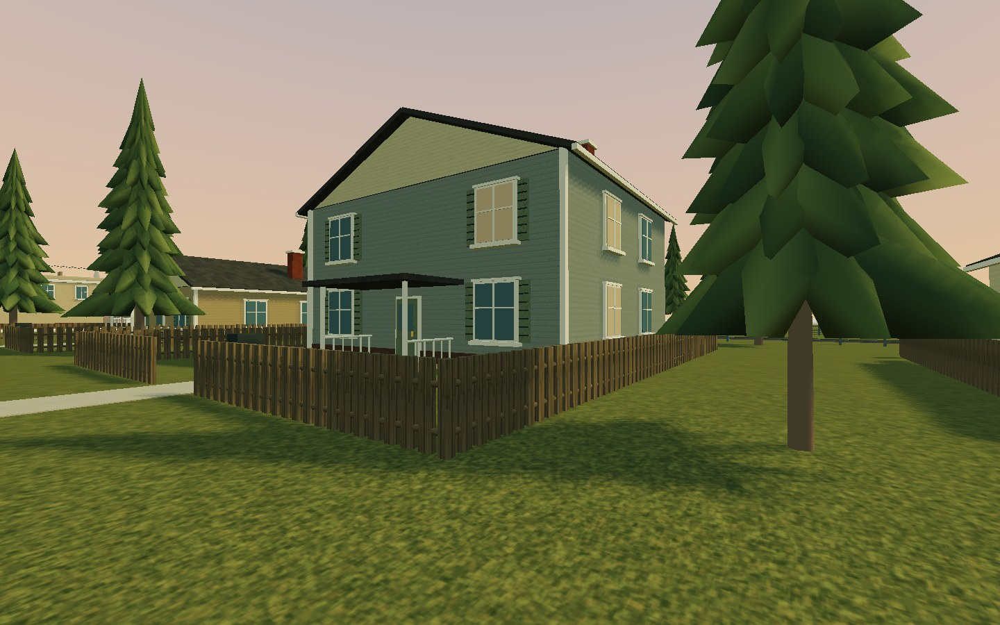
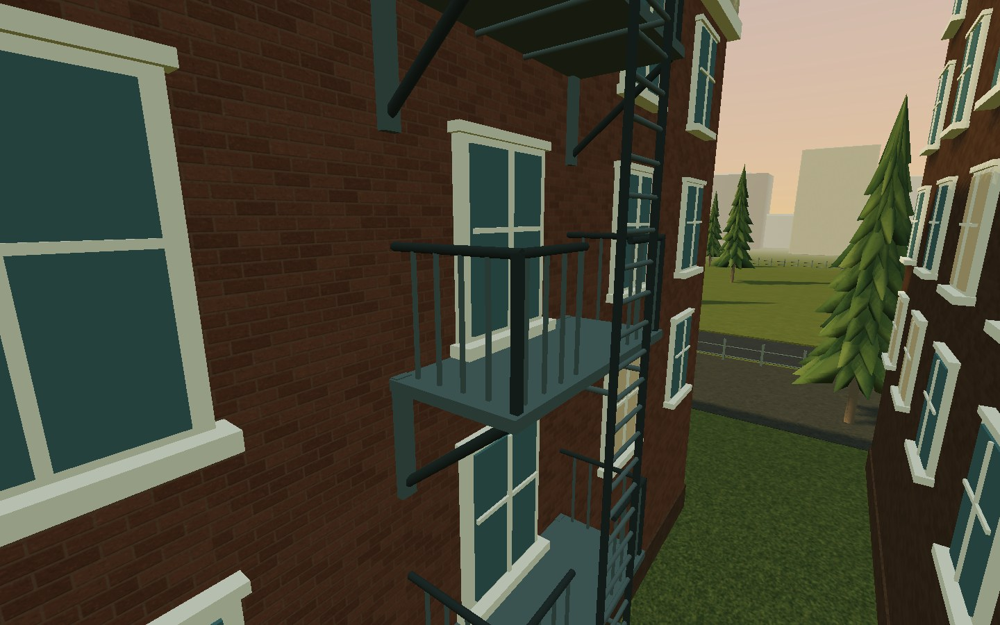

Pine Avenue extension:

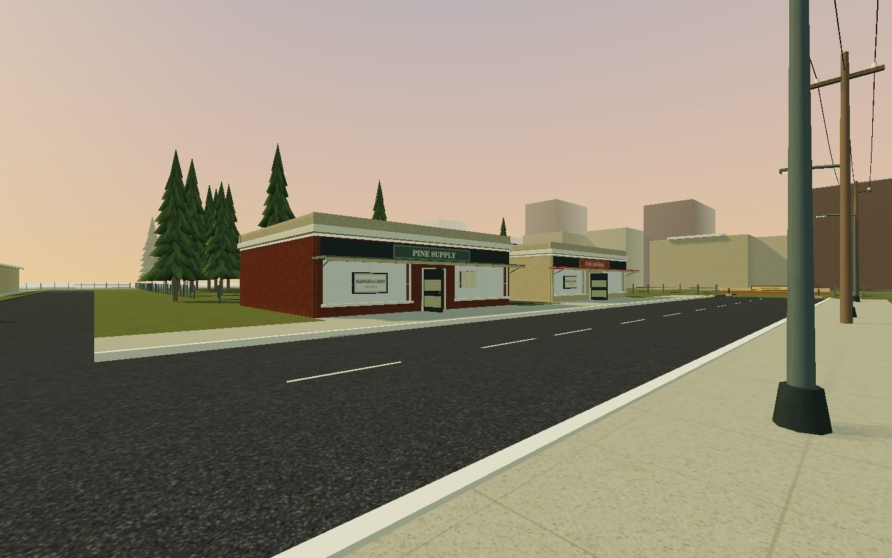
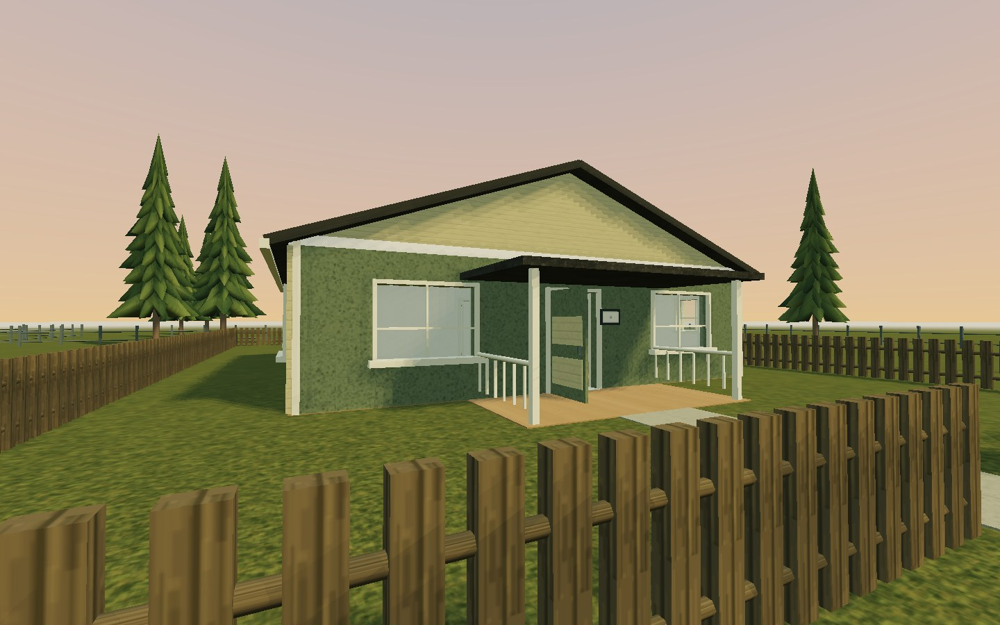
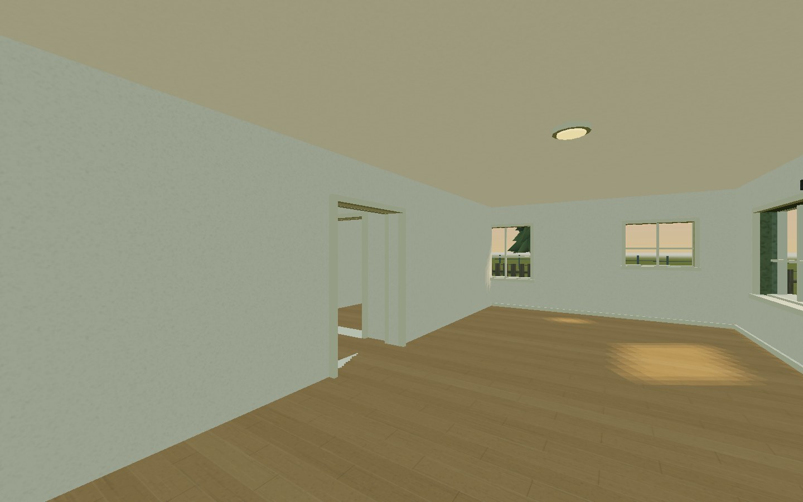
