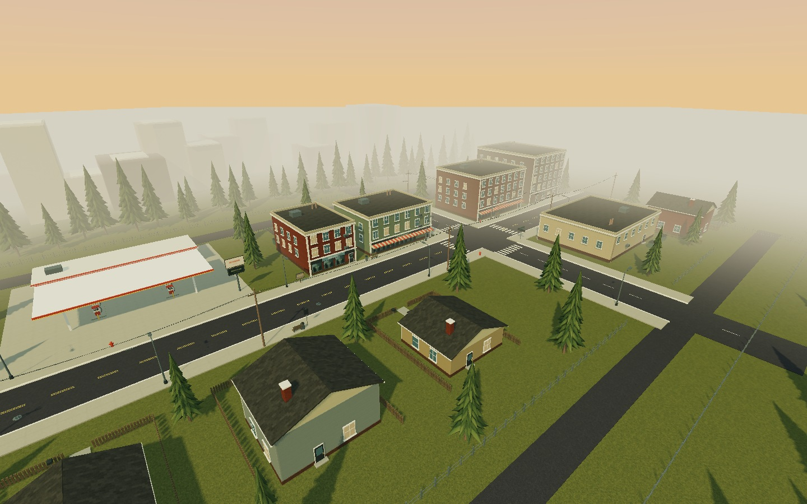

# Schedule 69 — Cedar Street

A small, original Three.js neighbourhood for a standalone Quest 3 VR game. Cedar Street includes a gas station, market, laundromat, diner, apartments, garage, and fenced houses. Pine Avenue continues north through two enterable shops and south to a residential stretch with an unfurnished starter house and a neighbouring home. Gameplay, NPCs, vehicles, inventory, and furniture are not implemented yet.

## Pine Avenue extension

From the Cedar Street intersection, follow Pine Avenue past the market toward the commercial end to find **Pine Supply** and **Pine General**. Both have open entrances, an empty main shop floor, a separate stockroom, and a rear exit.

In the opposite direction, past the garage and the rear service lane, **No. 18 Pine Avenue** is the green starter house. Its front and rear doors are propped open. Inside are a living room, bedroom, utility room, bathroom and central hall; the rear door leads to an empty fenced garden. The house across the street is exterior scenery.

Doors are static for this environment pass. There is no ownership, purchasing, shop stock, or door interaction yet. The architectural spaces are ready to build those systems into later.

## Explore

Open the GitHub Pages deployment directly in Meta Quest Browser and select **Enter VR**.

| Input | Action |
| --- | --- |
| Left thumbstick | Smooth, head-relative walking |
| Right thumbstick | Smooth turning, around the headset |
| Left stick click | Faster walking while held |
| Desktop WASD | Walk |
| Desktop Shift | Walk faster |
| Mouse drag / locked pointer | Look |
| Arrow keys | Forward/backward and smooth turning |
| Mobile left pad | Walk |
| Mobile drag | Look |

Movement is in metres. Normal walking is 2.4 m/s; smooth turning is about 77 degrees/s. WebXR uses `local-floor` to preserve the headset's measured height. The rig is offset when turning to keep the physical head position fixed. Buildings, fences, poles, trees, and large props have collision; movement slides along obstacles and is subdivided to prevent tunnelling.

## Development

```sh
npm ci
npm run dev
npm run check
npm run build
```

GitHub Actions builds and deploys `dist/` on pushes to `main`. Repository Settings → Pages should use **GitHub Actions** as the source. All production scripts are bundled locally; there are no runtime CDN, API, or asset-service dependencies.

## Scene structure

- `src/world.js`: layout and reusable building, house, fence, tree, and street-prop builders. Building fronts face local +Z. Use `b.area(x, z, yaw, callback)` to place a lot; distances use metres.
- `src/pine-avenue.js`: new shop shells, starter-home layout, real door/window openings, garden, and street extension. Named scene nodes `PineSupply`, `PineGeneralStore`, and `StarterHouse` identify the usable spaces. `world.places` and `world.starterHouse` expose their entrance and room positions for future gameplay integration.
- `src/geometry.js`: geometry batching, collision, and headset-pivot turning. Static pieces are merged by material and 40 m spatial cell for frustum culling.
- `src/materials.js`: deterministic texture generation and shared sign atlas. Brick, concrete, asphalt, roofing, and siding have metre-scaled UVs. Replace maps here when adding authored textures later.
- `src/main.js`: rendering, lighting, player rig, desktop/touch input, and WebXR session lifecycle.

The current scene contains 14 buildings, 65 instanced pines, about 109,290 geometry triangles (excluding sky and controller models), and 252 collision bounds. The initial desktop frustum intersects about 185 draw batches. Trees in the extension lots were moved or removed to keep paths and interiors clear. These are geometry counts, not a measured Quest frame rate.

Rendering uses Lambert materials, shared procedural textures, one static 2048 px directional shadow map, and WebXR foveation. Shadows are refreshed at startup and on VR session transitions. If a future change moves shadow casters, explicitly invalidate the shadow map or change the shadow update strategy.

## Verification

Production build, finite geometry, collision tunnelling/sliding, world boundaries, and turning with an offset headset have been checked. The neighbourhood check verifies 17 connected destinations from the original spawn, open entrances at head height, doorway traversal, rear garden access, solid wall collision, closed ceilings, and floors at the correct player height. Both checks run before deployment. The available remote browser had WebGL disabled, so live browser rendering, touch input, and real headset performance could not be verified there.

The images below are **offline geometry previews**, rendered from the same scene meshes and textures with approximate lighting. They are not browser screenshots or Quest performance evidence.




Pine Avenue extension:


